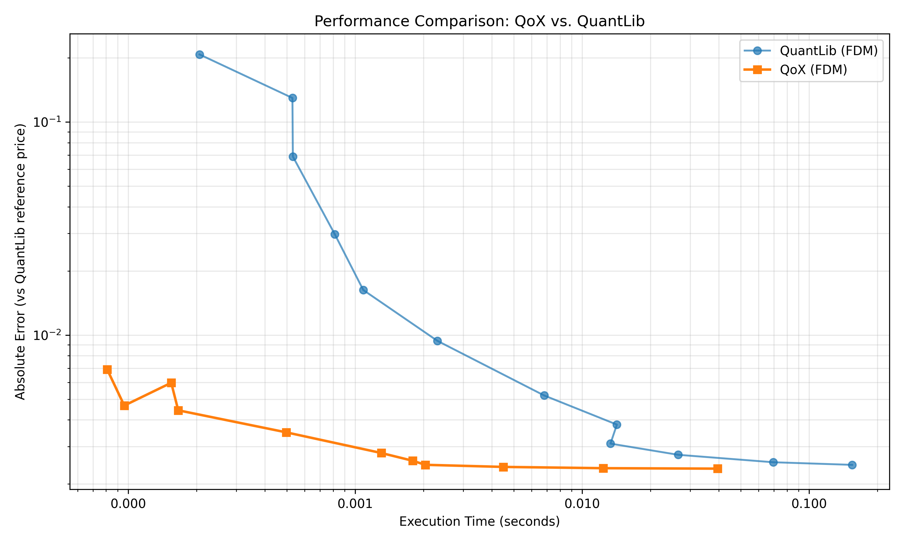

# QoX Python Examples

This directory contains sample implementations using the QoX library. You can run these locally or instantly in the cloud via Google Colab.

## 🚀 Get Started Instantly

The easiest way to explore these examples is via **Google Colab**. No installation required.

| Example | Notebook | Interactive Demo |
| :--- | :--- | :--- |
| **Quickstart Guide** | [`quickstart.ipynb`](./notebooks/quickstart.ipynb) | [](https://colab.research.google.com/github/bboutelje/qox-python-samples/blob/main/notebooks/quickstart.ipynb) |

## 🛠 Local Installation

If you are a developer and want to run these scripts on your own machine:

1. **Clone the repository:**
   ```bash
   git clone [https://github.com/bboutelje/qox-python-samples.git](https://github.com/bboutelje/qox-python-samples.git)
   cd qox-python-samples

## 🏎 Performance: QoX vs. QuantLib

This benchmark compares American Put pricing using Finite Difference Methods (FDM). 

**Result:** So far, QoX achieves at least a **10x speedup** over QuantLib for any given accuracy level.

| Steps | QL Latency | QL Error | QoX Latency | QoX Error |
| :--- | :--- | :--- | :--- | :--- |
| 5 | 1.49 ms | 1.57e-01 | **272.2 μs** | 1.53e-02 |
| 10 | 3.66 ms | 6.10e-02 | **938.9 μs** | 4.20e-03 |
| 25 | 6.36 ms | 2.77e-02 | **2.12 ms** | 2.30e-03 |
| 50 | 6.14 ms | 1.39e-02 | **2.67 ms** | 2.00e-03 |
| 100 | 12.58 ms | 6.82e-03 | **5.40 ms** | 2.40e-04 |
| 250 | 18.24 ms | 2.83e-03 | **9.99 ms** | 4.88e-04 |
| 500 | 35.94 ms | 1.43e-03 | **19.30 ms** | 2.99e-04 |
| 1000 | 70.82 ms | 7.10e-04 | **38.99 ms** | 1.04e-04 |
| 2000 | 148.76 ms | 3.48e-04 | **79.66 ms** | 2.34e-05 |



**This is just the baseline; further optimizations are in progress.**

> Run the test: [`benchmarks/fdm_temporal_convergence.py`](./benchmarks/fdm_temporal_convergence.py)
