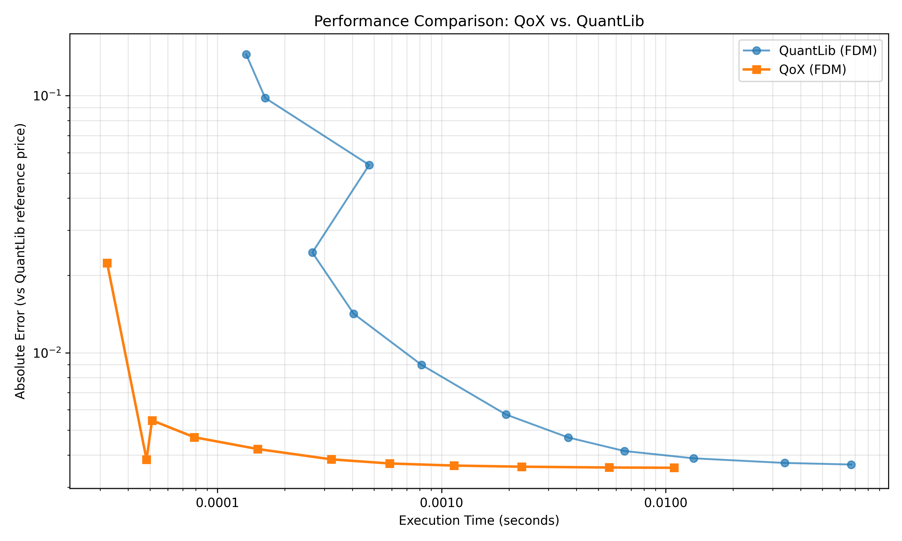

# QoX Python Examples

**QoX** is a high-performance finite difference quant library, written in Rust, designed with production environments in mind. These samples demonstrate its performance and ease of use.

---

## Consulting

*Inquire about consulting: **qox.library [at] gmail.com***

---

## 🚀 Get Started Instantly

The easiest way to explore these examples is via **Google Colab**. No installation required.

| Example | Notebook | Interactive Demo |
| :--- | :--- | :--- |
| **Quickstart Guide** | [`quickstart.ipynb`](./notebooks/quickstart.ipynb) |  |

## 🛠 Local Installation

Run `pip install qox`.

---

## 🏎 Performance: QoX vs. QuantLib

This benchmark compares American put pricing using the finite difference method where QoX achieves about a 40x speedup over QuantLib to get the same accuracy for a 1 year ATM option. While this is for single throughput evaluation, it is easily parallelised using SIMD vectorisation and multi-threading.

---

## 🗺️ Roadmap

**v0.2.0**
* Discrete dividends.
* Implied volatility solver.

**v0.3.0**
* Yield curve framework.
* Volatility surfaces.

**Other short-term goals**
* More advanced American options model.
* SABR model
* Other instruments
* Support for Business/252 day count.
