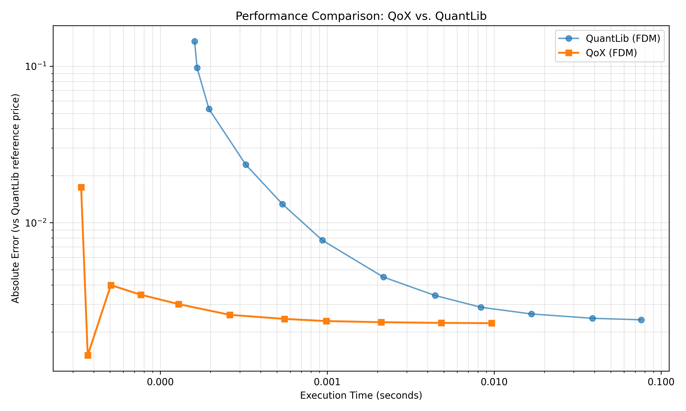

# QoX Python Examples

**QoX** is a finite difference quant library, written in Rust, with an unpublished numerical algorithm for American options. The samples provided in this repository demonstrate its performance. The current version (0.2.1) handles discrete dividends and implied volatility. It works for vol greater than 10%, and it is untested for negative rates and high dividend/borrow yield.

---

## Consulting

*Inquire about consulting: **qox.library [at] gmail.com***

Other projects:

Pricing Black-Scholes 3x faster than the COS method, applicable to other stochastic processes. Robust across volatilities and time to expiry, even where the COS method requires more terms.

Sub-microsecond discrete dividend handling for European options.

Sub-microsecond American option pricing in development.

Sub-microsecond option calibration in early development.

---

## Get Started Instantly

The easiest way to explore the examples is via **Google Colab**.

| Example | Notebook | Interactive Demo |
| :--- | :--- | :--- |
| **Quickstart Guide** | [`quickstart.ipynb`](./notebooks/quickstart.ipynb) |  |

## Local Installation

Run `pip install qox`.

---

## Performance: QoX vs. QuantLib

This benchmark compares American put pricing using the finite difference method where QoX achieves about a 40x speedup over QuantLib to get the same accuracy for a 1 year ATM American option. The point is simply show it's a lot faster for the same accuracy. This was done without SIMD and on one core.

